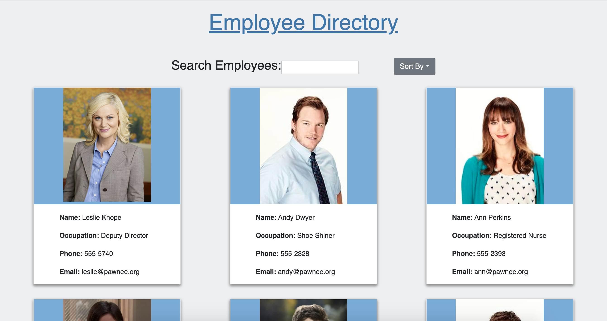

# employeedirectory

This application uses React.js to create a list of employees which can then be searched or sorted by category.

Deployed Application: https://ahoerman.github.io/employeedirectory/
 ***
    
## Table of Contents
[Installation](#Installation)

[Usage](#Usage)
    
[Licensing](#Licensing)
    
***
    
## Installation

## Usage
A search bar allows you to search by an input. You can also choose different categories from the dropdown to sort.
    
## Licensing
No License
    
    
***
    
### Email: awhoerman@me.com

    